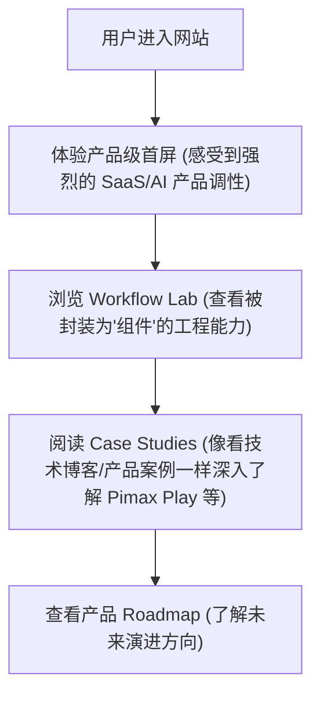

## 1. 产品概述
本项目是一个专注于展示“产品工程思维”的个人求职作品集网页，但在设计理念上彻底颠覆传统作品集，采用 **“AI Operating System (AI OS)” 或 “AI 产品官网”** 的设计隐喻。让浏览者第一反应是“这是一个成熟的 AI 产品”，从而隐性地证明求职者的产品工程能力。
- 主要目标：将个人能力产品化。通过高度组件化的 UI 展示求职者在 Workflow、Agent、知识工程和数据工程方面的能力。
- 目标受众：招聘方（HR、技术负责人、产品负责人）、技术同好。
- 核心价值：以“使用产品”的体验代替“阅读简历”的体验，支持无缝扩展新能力和新项目。

## 2. 核心功能模块

### 2.1 页面与模块规划
整体设计将采用 SaaS 产品或操作系统的经典布局（如顶栏导航 + 内容区块，或应用级交互结构）。
1. **Product Hero (首屏)**：像顶级 AI 产品的首页。介绍个人的“核心引擎”，例如“Meet [Name] OS”，强调解决复杂业务的能力。
2. **Workflow Lab (能力库)**：不再是传统的思维描述，而是像 Zapier/Dify 的组件库或能力集（Capabilities Library）。用户可以浏览不同的“工作流引擎”、“Agent 节点”等。
3. **Case Studies (项目案例)**：不再是项目截图+描述，而是像 Stripe/Vercel 的真实产品 Case Study，包含背景、架构挑战、解决方案与数据指标。
4. **Future Vision (演进方向)**：作为“产品路线图 (Roadmap)”展示未来规划。

### 2.2 模块详细描述
| 页面名称 | 模块名称 | 功能与交互描述 |
|-----------|-------------|---------------------|
| AI OS 首页 | 顶栏导航 | 类似产品官网的固定顶栏（包含 Logo、能力、案例、愿景等锚点）。 |
| AI OS 首页 | Product Hero | 极简、大留白，搭配产品界面示意图（如终端代码、数据流图或操作系统的抽象UI）。 |
| AI OS 首页 | Workflow Lab | 网格化（Bento Grid）展示，每个卡片是一个“能力节点”，鼠标悬停时展示类似代码运行或数据流动的微交互。 |
| AI OS 首页 | Case Studies | 长画卷或侧边栏切换结构，每个 Case Study 有独立的结构（挑战、架构图、结果）。 |
| AI OS 首页 | Vision Roadmap | 类似产品的 Changelog 或 Roadmap 列表。 |

## 3. 核心流程

## 4. 用户界面设计

### 4.1 设计风格
- **AI 产品官网质感 (SaaS / AI OS)**：采用类似 Vercel, Linear, OpenAI 的官网风格。背景以纯白或极浅灰色为主，辅以微妙的阴影、发光边框（Glow borders）和极细的网格线。
- **排版 (Typography)**：高度结构化。标题使用 Space Grotesk，正文使用 Inter。强调数据指标和代码块排版。
- **动效风格 (Motion)**：微交互（Micro-interactions）为主。例如鼠标悬停卡片时的光晕跟随（Hover Glow）、代码块打字效果、抽象系统图的流动动画。
- **高度组件化**：UI 必须是模块化的，未来可以通过简单配置 JSON 增加新的 Workflow Card 或 Case Study。

### 4.2 响应式设计
- **Desktop-first**：重点打磨 PC 端的复杂组件网格和悬停交互。
- **移动端适配**：移动端降级为单列信息流，保持代码块和数据指标的可读性。